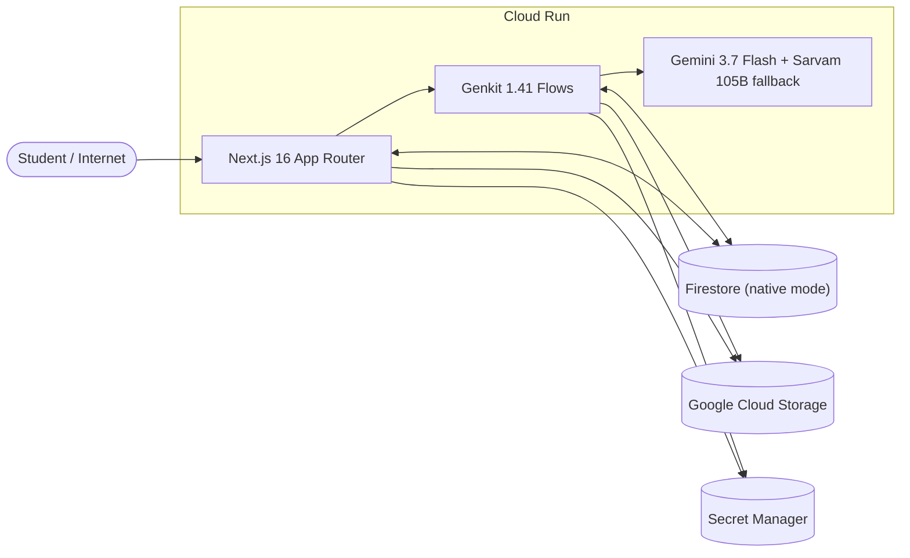

# Saint Elms Fire

> _Lux in tempestate_ — light in the storm.

An adaptive AI learning platform that transforms static courseware into a progressively-revealed, multimodal, knowledge-mapped learning experience. Built on Genkit + Gemini 3.7 Flash + Firestore for the "All Things Agentic" buildathon.

## What it does

Saint Elms Fire takes uploaded markdown lessons and, through a gated release pipeline, transforms them into:

- **Vector-indexed RAG chat** — students can only ask questions about lessons that have been released to them; unreleased content is never retrievable
- **Knowledge graph ("Second Brain")** — concepts and relationships are extracted during ingestion and visualized as an interactive constellation that grows as modules are released
- **Multimodal artifacts** — branded PDF notes and two-voice podcast audio (plus quizzes and video scripts), generated asynchronously from the student's own Second Brain corpus with visible source provenance
- **Collaborative Second Brain** — released lessons seed the graph, catalog-backed recommended readings are asynchronously added as post-release enrichment after finalization, and peers share notes that each student individually accepts (ingested into their own graph, dashed-ring nodes) or dismisses; a per-concept wiki page is the reading surface
- **Proactive Socratic tutor** — the system fires unprompted challenge questions based on quiz weak spots, then evaluates student responses
- **All-or-nothing releases** — a module release only becomes visible after every lesson is successfully chunked, embedded, and graph-extracted; failed ingestion never leaks visible-but-unindexed content

## Architecture



For the editable source with component responsibilities and environment flags, open `artifacts/architecture/architecture.drawio` in [diagrams.net](https://app.diagrams.net/).


### UGC Academic Hierarchy

The schema follows the University Grants Commission CBCS/NEP 2020 framework:

**Programme → Subject → Semester → Course → CourseModule → Lesson**

Every descendant carries its full ancestor chain as flat optional fields (`programmeId`, `subjectId`, `semesterId`), mirroring the `KnowledgeNode` pattern — so any layer can be queried directly without joins.

### Release integrity

Releases follow a strict state machine:

1. Admin creates a release → status `pending`
2. Each target lesson is chunked, embedded, and graph-extracted
3. All succeed → atomically transition to `released` (visible to student)
4. Any fail → transition to `failed` (never visible), with retry support

Legacy records with `status='released'` and no ingestion metadata remain visible for backward compatibility.

## Quick start

```bash
# Install dependencies
bun install

# Set up environment
cp .env.example .env
# Edit .env with your GEMINI_API_KEY

# Authenticate with Google Cloud (for Firestore)
gcloud auth application-default login

# Run the dev server
bun run dev
```

Open `http://localhost:3000/student` or `http://localhost:3000/admin`. The app auto-seeds demo courseware on first load.

## Environment variables

| Variable | Required | Description |
| --- | --- | --- |
| `GEMINI_API_KEY` | Yes | Google AI / Gemini API key |
| `GOOGLE_CLOUD_PROJECT` | For Firestore | GCP project ID |
| `FIRESTORE_DATABASE_ID` | No | Defaults to `(default)` |
| `SARVAM_API_KEY` | No | Sarvam fallback model key |
| `AUTH_MODE` | No | `demo` (default, local/development only) or `trusted-proxy` (required in production) |
| `DEMO_USER_ID` | No | Demo identity (default: `student-alex`) |
| `DEMO_USER_ROLE` | No | Demo role (default: `admin`) |
| `AUTH_PROXY_SECRET` | Prod | Shared secret for trusted-proxy mode (Secret Manager) |
| `ALLOW_PRODUCTION_SEED` | No | `true` only during initial demo seeding |

See [`.env.example`](.env.example) for the full template.

## Commands

```bash
bun run dev          # Start dev server
bun run build        # Production build
bun run typecheck    # TypeScript type checking
bun run start        # Start production server
bun test             # Run tests
```

## Deployment

Saint Elms Fire deploys to Cloud Run as a private service. See:

- [docs/PHASE3.md](docs/PHASE3.md) — Cloud Run deployment guide
- [docs/PHASE4_PLAN.md](docs/PHASE4_PLAN.md) — Production trust boundaries plan
- [docs/PHASE5.md](docs/PHASE5.md) — Deployment and submission readiness runbook

### Docker

```bash
docker build -t saint-elms-fire .
docker run -p 8080:8080 --env-file .env.production saint-elms-fire
```

The container exposes port 8080 with a healthcheck against `/health`.

## Buildathon constraint checklist

| Constraint | Status |
| --- | --- |
| Gemini 3.5+ model | ✅ Gemini 3.7 Flash (`gemini-3.7-flash`) |
| Google agent framework | ✅ Genkit 1.41 (`@genkit-ai/google-genai`) |
| At least one GCP service | ✅ Firestore (native mode), Cloud Run, Secret Manager |
| Public GitHub repository | ✅ |
| Working demo (live or video) | ✅ https://saint-elms-fire-demo-543329415341.asia-south1.run.app |

## Tech stack

- **Framework:** Next.js 16 (App Router, Turbopack) + React 19
- **AI:** Genkit 1.41 + Gemini 3.7 Flash + Sarvam 105B (fallback)
- **Database:** Google Cloud Firestore (native mode, vector search)
- **Styling:** Tailwind CSS v4 with custom "mariner's chart" design language
- **Runtime:** Bun (install) / Node 22 (build + serve on Cloud Run)
- **Fonts:** Fraunces (display), Instrument Sans (body), IBM Plex Mono (code)


